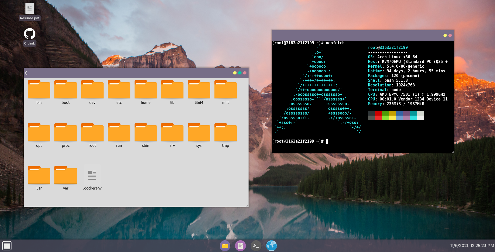

# RigdonOS

&nbsp;

RigdonOS is an in-browser desktop environment made using React and Node.js. It started as a portfolio site, but my goal is to turn it into something usable that you could run on a server so get a web-based GUI with a small footprint.

This repo contains a docker build script that you can use to spin up a local instance and play around with the different features. There is a working terminal emulator that interacts with the server that it is being hosted on as well as a file manager that you can use to explore the filesystem of the host. There is no support for doing anything besides viewing the file structure through the file manager, but those features are in the works. Besides that, there are a few demo apps to play around with the window management system.

The desktop environment is available to play around with at https://billyrigdon.dev. You can also build locally using the build scripts contained in this repo. I recommend running it in a docker container using the docker build file until this app is production ready.

&nbsp;

# Build Steps

&nbsp;

## Prerequisites

###### At a minimum, you will need to have npm and node.js installed on your machine. To take advantage of the automated build script you will also need to have docker installed.

&nbsp;

#### The following will install all 3 on Manjaro and configure docker, but you can use the package manager and distro of your choice to do the same.

    sudo pacman -S npm nodejs docker
    sudo systemctl enable --now docker.service
    sudo usermod -aG docker $USER

###### Note: You may need to log out and log back in after adding yourself to the docker group.

&nbsp;

### Clone the repo onto your local machine and navigate into the project:

    git clone https://github.com/billyrigdon/RigdonOS.git
    cd RigdonOS

&nbsp;

### Create .env file with port number you'd like or rename example.env to use the default port

    mv ./backend/example.env ./backend/.env

&nbsp;

#### Once the application is built and running, you can open a web browser and navigate to the web GUI using your server address and port number specified in the previous step.

&nbsp;

#### If building locally with the default port, the address would be http://127.0.0.1:1313

&nbsp;

## Automated Docker Build

&nbsp;

### In the main project directory, run the docker_build.sh script.

    ./docker_build.sh

&nbsp;

## Automated Local Build

&nbsp;

### In the main project directory, run the local_build.sh script

    ./local_build.sh

&nbsp;

## Manual Local Build

&nbsp;

### Navigate into both the backend and frontend directories and install all dependencies

##### Note: When installing the client dependencies, you will likely get some vulnerability warnings. The vulnerabilites are with the React build scripts and can be safely ignored as they aren't contained in the final build.

    cd ./backend
    npm install
    cd ../client
    npm install

&nbsp;

### In the client directory, run the React build tool to create the minified production build of the frontend.

    npm run build

&nbsp;

### Move the build folder into the backend directory

    mv ./build ../backend/build

&nbsp;

### Change into the backend directory and start the app

    npm start
